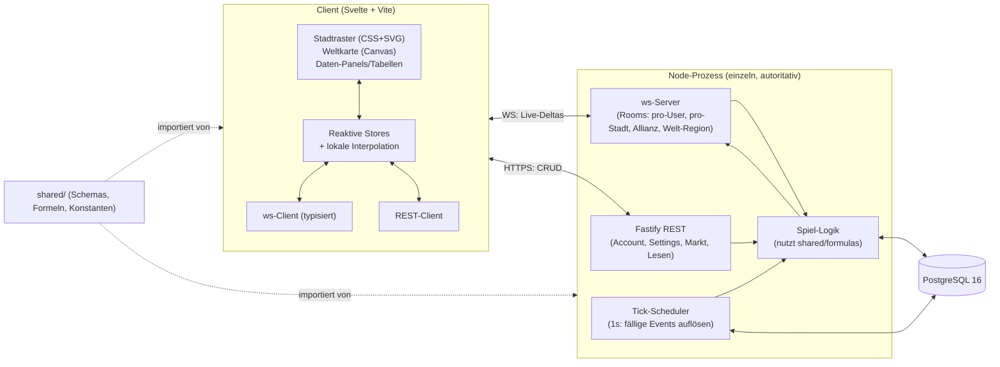

# Architektur

> Projekt: **Kingdoms of Adelia**. Thematik: eigene mittelalterliche Mythologie. Umfang: **eine gemeinsame Welt**, **selbst gehostet** (Ziel: zehn bis wenige hundert gleichzeitige Spieler). Der Server ist durchgehend **autoritativ** (der Client rendert und zeigt Vorschauen, entscheidet aber nie über den Zustand).

Dieses Dokument hält jede Tech-Entscheidung mit einer Ein-Zeilen-Begründung und der wichtigsten erwogenen Alternative fest. Aus dem Bootstrap festgelegte Entscheidungen sind mit 🔒 markiert.

## 1. Tech-Stack

| Belang | Entscheidung | Warum | Erwogene Alternative |
|---|---|---|---|
| Sprache | 🔒 **TypeScript**, `strict: true`, kein `any` | Eine Sprache über Client/Server/Shared; Typen sind der Vertrag | (keine — gesetzt) |
| Frontend-Framework | **Svelte 5 (Runes) + Vite** | Winzige Runtime, feingranulare Reaktivität zur Compile-Zeit (ideal für viele live tickende Zahlen), gescopetes CSS passend zum Token-System, flachste Lernkurve | **SolidJS** (sehr knapp dahinter; nur wegen kleinerem Ökosystem verworfen). 🔒 React/Next ausgeschlossen. |
| Styling | **Reines CSS + CSS Custom Properties** (Design-Tokens), komponenten-gescopet | „Nah am Metall", exakte Kontrolle über die gewünschte Datendichte | **Tailwind** (verworfen: Utility-Wildwuchs kämpft gegen eigene Dichte-Tokens) |
| Stadtraster-Rendering | **CSS-Grid + SVG-Overlay** | Stadt ist ein begrenztes Raster (~hunderte Felder); DOM liefert Hit-Testing, Tooltips, Tastatur-Navigation, Barrierefreiheit gratis; SVG zeichnet Adjazenz-Verbindungen/Highlights | Canvas (für die Stadt verworfen: verliert günstige Interaktivität) |
| Weltkarten-Rendering | **Canvas 2D** mit Viewport-Culling + Tile-Cache | Weltkarte ist groß (Pan/Zoom über viele Tiles); DOM skaliert nicht | **WebGL/PixiJS** (zurückgestellt — Upgrade-Pfad, falls die Tile-Mengen es erfordern) |
| Backend-Framework | **Fastify** | Schema-first-Validierung, die zu unseren geteilten Zod-Verträgen passt; starke TS-Unterstützung; schnell | **Express** (der vertraute Standard; wegen schwächerer eingebauter Validierung/Typen verworfen — aber dünn genug, um günstig zu wechseln) |
| Realtime-Transport | **`ws`** (rohes WebSocket) mit typisiertem Nachrichten-Protokoll | Schlank, volle Kontrolle über das Protokoll via geteilte Schemas, minimaler Overhead; wir bauen eine kleine Room-/Subscription-Schicht | **socket.io** (verworfen: schwerer, meinungsstark, in unserer Größe unnötig) |
| Datenbank | 🔒 **PostgreSQL 16** (Dev + Prod) | Eine DB überall; starkes Indexing, JSONB, Zeit-Arithmetik für den Scheduler | (keine — gesetzt; **kein SQLite**) |
| DB-Zugriff | **Kysely** (typisierter Query-Builder) + dessen Migration-Runner | Durchgängige Typsicherheit ohne schweres ORM; nah an SQL für Tick-Loop-Query-Tuning | **Knex** (weniger typsicher), **Prisma** (🔒 ausgeschlossen — zu schwer/opak für unsere Query-Muster) |
| Validierung / Verträge | **Zod**-Schemas in `shared/` | Eine Quelle der Wahrheit für REST-Bodies, WS-Payloads und Datendatei-Validierung; TS-Typen daraus ableiten | io-ts / typebox (verworfen: Ergonomie) |
| Lokale DB-Entwicklung | **Docker Compose** (`postgres:16-alpine`) | `docker compose up -d db` → sauberes lokales Postgres in Sekunden | Native Installation (verworfen: Drift pro Rechner) |
| Build/Dev | **Vite** (Client); **tsx** (Server-Dev/Watch), **tsc** (Typecheck) + **esbuild** (Server-Bundle); **npm workspaces** Monorepo | Minimale Toolchain; schnelles HMR im Client, schneller Restart im Server | Turborepo/nx (verworfen: Overkill in dieser Größe) |
| Lint/Format | **ESLint** (`@typescript-eslint` strict) + **Prettier** (Defaults) | Konsistenz, fängt `any`/Unsicheres | — |
| Asset-Pipeline | **SVG** für UI-Icons (Sprite-Sheet), **PNG/WebP** für Tiles; alles eigen | Scharfe skalierbare UI, kompakte Tiles | — |

## 2. Modulgrenzen

```
shared/          # von BEIDEN (Client und Server) importiert — keine Node- oder DOM-APIs
  schemas/       # Zod-Schemas: REST-Bodies, WS-Nachrichten, Datendatei-Formen
  constants/     # PROJECT_NAME, Ressourcen-/Gebäude-/Einheiten-Enums, Stellschrauben
  types/         # aus Schemas abgeleitete Typen; Domänentypen
  formulas/      # REINE deterministische Funktionen: Adjazenz, Kosten, Produktion,
                 #   Kampf-Mathematik, Reisezeit. Server = Quelle der Wahrheit;
                 #   Client = nur optimistische Vorschau. Gleicher Code → kein Drift.

server/
  src/           # Bootstrap, Config, DI-Verdrahtung
  db/
    migrations/  # Kysely-Migrationen (mit Zeitstempel)
    schema.sql   # generierter Referenz-Snapshot des aktuellen Schemas
  game/          # Tick-Scheduler, Ressourcenmodell, Bau, Kampf, Markt, Allianz
  routes/        # Fastify-REST-Handler (Account, Settings, Markt, Lese-APIs)
  ws/            # ws-Server: Verbindung, Auth, Rooms/Subscriptions, Dispatch

client/
  src/           # Svelte-App: Stores, Views (Stadtraster, Weltkarte, Panels),
                 #   ws-Client, REST-Client, lokale Interpolation
  public/        # statisch
  assets/        # NUR EIGENE Grafik (siehe IP-COMPLIANCE.md)
  design-system.html  # lebende Komponenten-Demo

data/            # buildings.yaml, units.yaml, resources.yaml — Balance-Daten,
                 #   beim Laden durch shared/schemas validiert
```

**Regel:** `shared/` bleibt umgebungsneutral (kein `fs`, kein `window`). Der Client darf `shared/formulas` importieren, um das Ergebnis einer Aktion zu *zeigen* (Vorschau), aber der Server rechnet autoritativ nach, und sein gesendetes Ergebnis gewinnt.

## 3. Systemdiagramm



## 4. Der Tick-Loop — server-autoritativ, zeitstempelgetrieben

Wir berechnen **nicht** jede Stadt jede Sekunde neu. Zwei Ideen halten es günstig (beide aus OpenLoUs Schema abgeleitet — siehe `research/openlou-analysis.md`):

### 4.1 Ressourcen werden analytisch berechnet, nicht getickt
Jede Stadt speichert pro Ressource: `amount`, `rate_per_hour`, `capacity` und `as_of` (Zeitstempel). Aktueller Stand beim Lesen:
```
current = min(capacity, amount + rate_per_hour × verstricheneStunden(now - as_of))
```
Wir **materialisieren** (schreiben `amount` zurück + setzen `as_of` neu) nur, wenn sich die Rate ändert oder Ressourcen verbraucht werden (Bau starten, Einheiten trainieren, geplündert werden). Untätige Städte kosten null CPU. Der Client rechnet dieselbe Formel lokal, um Zähler zwischen Syncs flüssig zu animieren.

### 4.2 Diskrete Events sind Zeilen mit einem `resolve_at`-Zeitstempel
Bau-/Ausbau-Abschluss, Einheiten-Trainings-Batches, Truppenankunft und Kampfauflösung werden mit einem `resolve_at` persistiert. Der Scheduler erledigt pro Tick einen günstigen Job:
```
alle 1000ms:
  rows = SELECT ... WHERE resolve_at <= now() ORDER BY resolve_at  (indiziert)
  für jede Zeile (in Zeit-Reihenfolge):
     Effekt anwenden (atomar, in einer Transaktion)
     Folge-Event einreihen
     WS-Delta an betroffene Rooms senden
```
Die Tick-Taktung ist **1 s** für Reaktionsschnelligkeit; die Korrektheit hängt nicht von der Tick-Präzision ab, weil Effekte zeitgestempelt sind (ein verpasster/verspäteter Tick löst kurz darauf deterministisch auf).

### 4.3 Adjazenz wird gecacht
Der Adjazenz-Multiplikator eines Bau-Slots ist teuer (bis zu 8 Nachbarn × 3 Bonus-Gruppen scannen). Wir speichern ihn pro Slot und berechnen ihn **nur** neu, wenn ein Gebäude in der Stadt platziert/ausgebaut/abgerissen wird (OpenLoUs `need_refresh`-Flag). Produktionsrate = `base(level) × cached_multiplier`.

## 5. Datenfluss-Durchläufe

**Gebäudebau**
1. Client zeigt Kosten/Zeit-Vorschau via `shared/formulas` und `data/buildings.yaml`; signalisiert Leistbarkeit.
2. `POST /cities/:id/build {slot, buildingType}` (oder WS-`build`-Nachricht). Server validiert: Slot leer, Voraussetzungen erfüllt, Hall-Gebäudelimit nicht überschritten, Ressourcen ausreichend.
3. Server materialisiert Ressourcen, zieht Kosten ab, fügt eine `queue`-Zeile mit `resolve_at = now + buildTime / constructionSpeed` ein. Sendet `queue.updated`.
4. Scheduler löst bei `resolve_at` auf: schreibt das Gebäude (Stufe 1 / +1), markiert Stadt `need_refresh`, berechnet betroffene Adjazenz-Multiplikatoren + Produktionsraten neu, materialisiert Ressourcen, sendet `city.updated`.

**Ressourcenproduktion** — keine Arbeit pro Tick; siehe §4.1. Bei Bedarf beim Lesen und bei jedem raten-ändernden Event neu berechnet.

**Kampf** (Phase 4)
1. Angreifer wählt Ziel + Armee → Client zeigt Reisezeit-Vorschau via `shared/formulas` (Distanz/Tempo).
2. `POST /attacks` validiert Armee-Verfügbarkeit + Befehls-Queue-Slot (Citadel). Fügt `military_action` mit `resolve_at = now + travelTime` ein, reduziert Heimat-Garnison.
3. Scheduler bei Ankunft: lädt Verteidiger-Garnison + City-Wall-Bonus, führt deterministischen Kampf aus (`shared/formulas/combat`), berechnet Verluste + Plünderung (gedeckelt durch Tragekapazität), plant die Rückreise, sendet `combat.report` an beide Parteien.

**Marktplatz** (Phase 4) — Inserat = REST-CRUD-Zeile; ein Kauf plant einen Karren-/Schiff-Transfer (wie `military_action`) mit `resolve_at` = Reisezeit; Ressourcen werden bei Auflösung bewegt.

**Allianz** (Phase 4) — Mitgliedschaft/Rollen sind REST-CRUD; Allianz-Chat + Events laufen über einen WS-`alliance:{id}`-Room.

## 6. Realtime-Protokoll

- **WS = Live-Deltas**, die der Nutzer sofort sehen muss: Bau-/Trainings-Abschluss, eingehender Angriff + Kampfbericht, Chat, Änderungen der Ressourcenrate. Nachrichten sind `{type, payload}`, validiert durch geteilte Zod-Schemas; Richtung dokumentiert in `GAME-DATA-SCHEMA.md`.
- **Rooms/Subscriptions**: ein Client abonniert seinen `user:{id}` und die aktuell geöffnete `city:{id}`; Allianzmitglieder treten `alliance:{id}` bei; Weltkarten-Betrachter treten groben `region:{cx},{cy}`-Rooms bei, damit Karten-Deltas nur an Betrachter fächern.
- **REST = alles andere**: Auth, Settings, Markt-Inserate, Bestenlisten, historische Berichte, initiale Zustands-Hydration beim Laden.

## 7. Skalierungs-Hinweise (selbst gehostete Größe)

- **Ziel:** zehn bis wenige hundert gleichzeitig; ein Node-Prozess + ein Postgres auf einer Maschine. **Kein Sharding, kein `world_id`** (eine Welt per Entscheidung).
- **Erwartete Engpässe & Gegenmaßnahmen:**
  - Fällige-Events-Query pro Tick → Covering-Index auf `resolve_at`; in einer Transaktion bündeln; Query begrenzt halten (`LIMIT`, Schleife bis geleert).
  - WS-Fan-out in geschäftigen Regionen → grobe Region-Rooms; Karten-Deltas auf ~1 Hz bündeln.
  - Kampf-Spitzen → sequentiell im Scheduler auflösen; Kampf-Mathematik ist rein und schnell.
  - Ressourcen-Materialisierungs-Writes → nur bei Ratenänderung, nicht beim Lesen.
- **Falls es je öffentlich ginge** (ausdrücklich außerhalb des Umfangs): Scheduler in einen eigenen Prozess auslagern, Postgres-Read-Replicas für Karten-/Bestenlisten-Reads, Weltkarte nach Region partitionieren. Mitgedacht, nicht jetzt gebaut.

## 8. Tests & Qualität (vollständiger Standard in `CLAUDE.md`)

- Das testen, was falsch sein kann und wehtut: `shared/formulas` (Adjazenz, Kosten, Produktion, Kampf, Reise), Scheduler-Auflösungsreihenfolge, Schema-Validierung. UI-Kleinkram auslassen.
- Determinismus: alle Spiel-Mathematik sind reine Funktionen von `(state, data, timestamps)` → reproduzierbar und ohne DB testbar.
