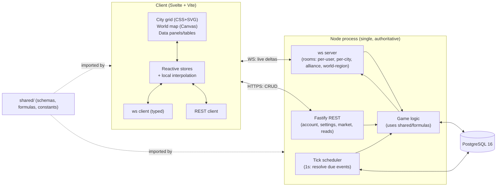

# Architecture

> Working title: **Aldermark**. Theme: original-mythology medieval. Scope: **single shared world**, **self-hosted** (target: tens to low-hundreds of concurrent players). Server is **authoritative**; the client renders and previews but never decides state.

This document records every tech decision with a one-line justification and the main alternative considered. Locked decisions (from the project brief) are marked 🔒.

## 1. Tech stack

| Concern | Decision | Why | Alternative considered |
|---|---|---|---|
| Language | 🔒 **TypeScript**, `strict: true`, no `any` | One language across client/server/shared; types are the contract | (none — locked) |
| Frontend framework | **Svelte 5 (runes) + Vite** | Tiny runtime, compile-time fine-grained reactivity (ideal for many live-ticking numbers), scoped CSS that pairs with our token system, gentlest learning curve | **SolidJS** (very close 2nd — signals are excellent; rejected only for smaller ecosystem). 🔒 React/Next excluded. |
| Styling | **Plain CSS + CSS custom properties** (design tokens), component-scoped | "Close to the metal", exact control of the data-dense density we want | **Tailwind** (rejected: utility churn fights bespoke density tokens) |
| City grid rendering | **CSS Grid + SVG overlay** | City is a bounded grid (~hundreds of plots); DOM gives free hit-testing, tooltips, keyboard nav, accessibility; SVG draws adjacency links/highlights | Canvas (rejected for city: loses cheap interactivity) |
| World map rendering | **Canvas 2D** with viewport culling + tile cache | World map is large (pan/zoom over many tiles); DOM won't scale | **WebGL/PixiJS** (deferred — upgrade path if tile counts demand it) |
| Backend framework | **Fastify** | Schema-first validation that dovetails with our shared zod contracts; great TS support; fast | **Express** (the familiar default; rejected for weaker built-in validation/types — but a thin enough layer that switching is cheap) |
| Realtime transport | **`ws`** (raw WebSocket) with a typed message protocol | Lean, full control of the protocol via shared schemas, minimal overhead; we add a small room/subscription layer | **socket.io** (rejected: heavier, opinionated protocol, unneeded at our scale) |
| Database | 🔒 **PostgreSQL 16** (dev + prod) | One DB everywhere; strong indexing, JSONB, time math for the scheduler | (none — locked; **no SQLite**) |
| DB access | **Kysely** (typed query builder) + its migration runner | End-to-end type safety with no heavy ORM; close to SQL for tick-loop query tuning | **Knex** (less type-safe), **Prisma** (🔒 excluded — too heavy/opaque for our query patterns) |
| Validation / contracts | **Zod** schemas in `shared/` | Single source of truth for REST bodies, WS payloads, and data-file validation; infer TS types from them | io-ts / typebox (rejected: ergonomics) |
| Local DB dev | **Docker Compose** (`postgres:16-alpine`) | `docker compose up -d db` → clean local Postgres in seconds | Native install (rejected: per-machine drift) |
| Build/dev | **Vite** (client); **tsx** (server dev/watch), **tsc** (typecheck) + **esbuild** (server bundle); **npm workspaces** monorepo | Minimal toolchain; fast HMR client, fast restart server | Turborepo/nx (rejected: overkill at this size) |
| Lint/format | **ESLint** (`@typescript-eslint` strict) + **Prettier** (defaults) | Consistency, catch `any`/unsafe | — |
| Asset pipeline | **SVG** for UI icons (sprite sheet), **PNG/WebP** for tiles; all original | Crisp scalable UI, compact tiles | — |

## 2. Module boundaries

```
shared/          # imported by BOTH client and server — no Node or DOM APIs
  schemas/       # zod schemas: REST bodies, WS messages, data-file shapes
  constants/     # PROJECT_NAME, resource/building/unit enums, tunables
  types/         # types inferred from schemas; domain types
  formulas/      # PURE deterministic functions: adjacency, costs, production,
                 #   combat math, travel time. Server = source of truth;
                 #   client = optimistic preview only. Identical code → no drift.

server/
  src/           # bootstrap, config, di wiring
  db/
    migrations/  # Kysely migrations (timestamped)
    schema.sql   # generated reference snapshot of current schema
  game/          # tick scheduler, resource model, construction, combat,
                 #   market, alliance — the authoritative game logic
  routes/        # Fastify REST handlers (account, settings, market, read APIs)
  ws/            # ws server: connection, auth, rooms/subscriptions, dispatch

client/
  src/           # Svelte app: stores, views (city grid, world map, panels),
                 #   ws client, REST client, local interpolation
  public/        # static
  assets/        # ORIGINAL art only (see IP-COMPLIANCE.md)
  design-system.html  # living component demo

data/            # buildings.yaml, units.yaml, resources.yaml — balance data,
                 #   validated by shared/schemas at load time
```

**Rule:** `shared/` must stay environment-agnostic (no `fs`, no `window`). The client may import `shared/formulas` to *preview* an action's outcome, but the server recomputes authoritatively and the result it broadcasts wins.

## 3. System diagram



## 4. The tick loop — server-authoritative, timestamp-driven

We do **not** recompute every city every second. Two ideas keep it cheap (both informed by OpenLoU's schema — see `research/openlou-analysis.md`):

### 4.1 Resources are computed analytically, not ticked
Each city stores, per resource: `amount`, `rate_per_hour`, `capacity`, and `as_of` (timestamp). Current amount on read:
```
current = min(capacity, amount + rate_per_hour × hoursElapsed(now - as_of))
```
We **materialize** (write back `amount` + bump `as_of`) only when something changes the rate or consumes resources (start a build, train units, get plundered). Idle cities cost zero CPU. The client runs the same formula locally to animate counters smoothly between syncs.

### 4.2 Discrete events are rows with a `resolve_at` timestamp
Build/upgrade completion, unit-training batches, troop arrival, and combat resolution are persisted with a `resolve_at`. The scheduler does one cheap job per tick:
```
every 1000ms:
  rows = SELECT ... WHERE resolve_at <= now() ORDER BY resolve_at  (indexed)
  for each row (in time order):
     apply effect (atomically, in a tx)
     enqueue any follow-on event
     emit WS delta to affected rooms
```
Tick cadence is **1 s** for responsiveness; correctness does not depend on tick precision because effects are timestamped (a missed/late tick just resolves a moment later, deterministically).

### 4.3 Adjacency is cached
A construction slot's adjacency multiplier is expensive (scan up to 8 neighbors × 3 bonus groups). We store it per slot and recompute **only** when a building in that city is placed/upgraded/demolished (OpenLoU's `need_refresh` flag). Production rate = `base(level) × cached_multiplier`.

## 5. Data-flow walkthroughs

**Building construction**
1. Client previews cost/time via `shared/formulas` and `data/buildings.yaml`; shows affordability.
2. `POST /cities/:id/build {slot, buildingType}` (or WS `build` msg). Server validates: slot empty, prereqs met, TH building-cap not exceeded, resources sufficient.
3. Server materializes resources, deducts cost, inserts a `queue` row with `resolve_at = now + buildTime / constructionSpeed`. Emits `queue.updated`.
4. Scheduler resolves at `resolve_at`: writes the construction (level 1 / +1), flags city `need_refresh`, recomputes affected adjacency multipliers + production rates, materializes resources, emits `city.updated`.

**Resource production** — no per-tick work; see §4.1. Recomputed lazily on read and on every rate-changing event.

**Combat** (Phase 4)
1. Attacker selects target + army → client previews travel time via `shared/formulas` (distance/speed).
2. `POST /attacks` validates army availability + command-queue slot (Citadel). Inserts `military_action` with `resolve_at = now + travelTime`, decrements home garrison.
3. Scheduler at arrival: loads defender garrison + City Wall bonus, runs deterministic combat (`shared/formulas/combat`), computes casualties + plunder (capped by carry capacity), schedules the return trip, emits `combat.report` to both parties.

**Marketplace** (Phase 4) — listing = REST CRUD row; a purchase schedules a cart/ship `military_action`-style transfer with `resolve_at` = travel time; resources move on resolution.

**Alliance** (Phase 4) — membership/roles are REST CRUD; alliance chat + events flow over a WS `alliance:{id}` room.

## 6. Realtime protocol

- **WS = live deltas** the user must see immediately: construction/training completion, incoming attack + combat report, chat, resource-rate changes. Messages are `{type, payload}` validated by shared zod schemas; direction documented in `GAME-DATA-SCHEMA.md`.
- **Rooms/subscriptions**: a client subscribes to its `user:{id}` and currently-open `city:{id}`; alliance members join `alliance:{id}`; world-map viewers join coarse `region:{cx},{cy}` rooms so map deltas fan out only to lookers.
- **REST = everything else**: auth, settings, market listings, leaderboards, historical reports, initial state hydration on load.

## 7. Scalability notes (self-hosted scale)

- **Target:** tens–low hundreds concurrent; single Node process + single Postgres on one box. **No sharding, no `world_id`** (single world by decision).
- **Anticipated bottlenecks & mitigations:**
  - Due-event query each tick → covering index on `resolve_at`; batch + process in one tx; keep the query bounded (`LIMIT`, loop until drained).
  - WS fan-out on busy regions → coarse region rooms; coalesce map deltas into ~1 Hz batches.
  - Combat bursts → resolve sequentially in the scheduler; combat math is pure and fast.
  - Resource materialization writes → only on rate change, not on read.
- **If it ever went public** (explicitly out of scope): split the scheduler into its own process, add Postgres read replicas for map/leaderboard reads, partition the world map by region. Designed-for, not built-now.

## 8. Testing & quality (see `CLAUDE.md` for the full standard)

- Unit-test the things that can be wrong and hurt: `shared/formulas` (adjacency, costs, production, combat, travel), scheduler resolution ordering, schema validation. Skip UI minutiae.
- Determinism: all game math is pure functions of `(state, data, timestamps)` → reproducible and testable without a DB.
